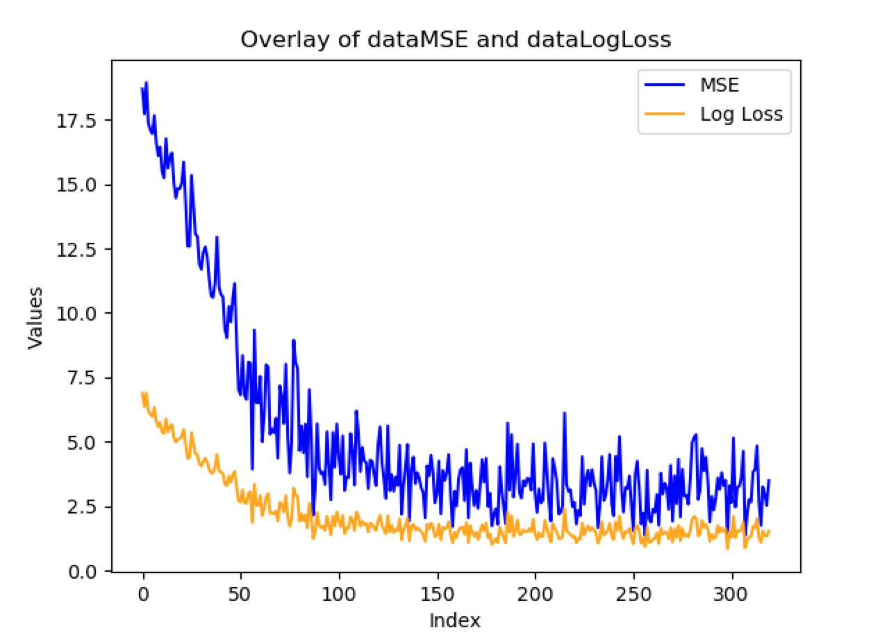
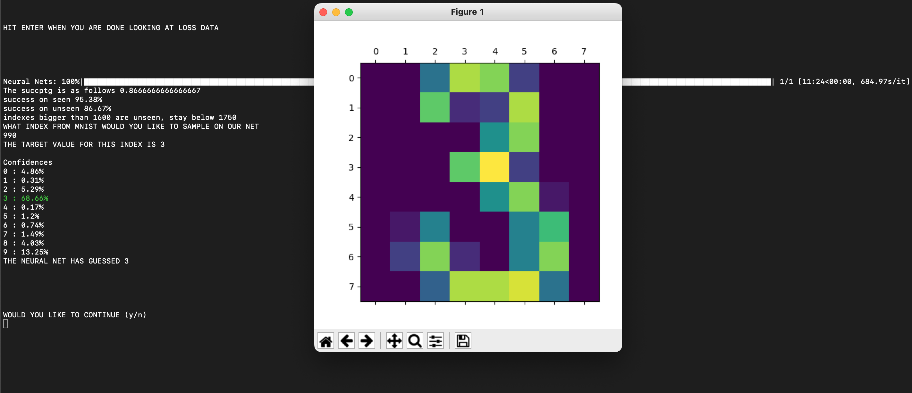

# Neural Net from scratch

This project aims to illustrate how neural networks function using the visual analogue (even at the cost of worse performance). Additionally it does not use any Machine Learning specific libraries like pytorch or TensorFlow (does use sklearn but only for the dataset). The project was originally inspired by 3Blue1Brown's youtube series on [neural networks](https://www.youtube.com/watch?v=aircAruvnKk&list=PLZHQObOWTQDNU6R1_67000Dx_ZCJB-3pi&ab_channel=3Blue1Brown).
 

## How To Run

In order to run this project it is heavily recommended to have conda installed. This will greatly simplify the instillation process. If you have conda run the following commands 

```sh
conda create -n "testEnv"
conda activate testEnv
```

Next you can run a shell script that installs all the necessary dependencies. This shell script will check if you have conda, pip and pip3 in that order and will attempt to install the necessary dependencies using the system available. If you have conda the environment used to develop the project is copied into the empty conda environment (testEnv) you have made

```sh
sh install.sh
```

The script installs python version 3.5.6 along with the packages:

* matplotlib (3.0.3): Tool for graphing cost function over time and showing image of hand drawn number.
* numpy (1.14.2): Used to optimize dot product.
* sklearn (0.0): Used to get MNIST data set.
* tqdm (4.64.1): Imports loading bar to track progress
* termcolor (1.1.0): Gives color to some terminal text

It may be difficult to find a version of python that supports all of these packages with these exact versions since the version requirement of python can be shifted up by developers. I recommend just trying to install them without the version with python 3.7. Furthermore if you do not have conda and run the shell script it will still run however it will not install python for you and will install arbitrary versions of the packages. 

Once you have completed the installation process you can run the project by running

```sh
python main.py
```

## Documentation of Code

The following code contains contains 4 classes that allow the program to run.

* `Perceptron`: The smallest unit inside the neural network which handles the different functions a perceptron needs. This includes storing how many different sources does it take input from how many sources does it output to, and can store things like pre-sigmoid activation and can activate using pre sigmoid activation and applying the sigmoid function. 

* `NeuralNetwork`: This class is of type list and is the actual neural network thus storing all perceptron.

* `BackPropagation`: Deals with the finding the actual gradient, also  probably the most math heavy/interesting part.

* `Funcs`: Stores a wide range of useful functions that deal with dot product optimization, random initialization for perceptron weights, exponential decay of learning rate, user interface, etc.

## How To Use

Inside of main.py you should be able to see this section

```python
#                       =====================    Personal Preferences     =====================

see_success_as_they_train = False

#                       =====================    Personal Preferences     =====================


#                       =====================    Hyperparameter     =====================

# Size of each layer (input and output are determined)
layerDimensions  = [64, 29, 10]

# Number of images we will use
nImages = 1600

miniSize = 20

# Number of Epochs
nEpochs = 4

# learning rate
learnR = 0.1

# decay rate (exponential loss)
decay_rate = 2

#If we repeat
tryMulti = 1

#                       =====================     Hyperparameter    =====================
            

```

This allows you to tune how you want the neural net to train and how many neural nets you want (system will automatically choose the best). Additionally you can choose to see extra print statements which gives more information as the neural nets train. If you elect to only run one neural net the loss function over time is also given.

*Note: Its useful to look that the git log to see which commits had what success rate (success rate given in commit message), from the commit you can retrieve the hyperparameter*


### Basic Setup

As previously stated, once all the packages are installed, you can directly run it through the following command.

```sh
python main.py
```

The program will ask you if you want to train a new neural net (using the hyperparameter in main.py) or if you would like to test an old neural network stored in a pkl file with the following prompt (enter s for saved and t for train and return).

```sh
Would you like to test saved version or or train a new one s/t
```

If you delete the pkl file the program will automatically train and the prompt will not appear. If you are training only one neural net you will see the loss data at this stage. Here Is an example of what the loss data might look like



You will also be given the prompt 

```sh
HIT ENTER WHEN YOU ARE DONE LOOKING AT LOSS DATA 
```

From here you can hit enter to continue. At this point if you are testing a saved version or if you are continuing from the previous step you will be able to test the neural net with the prompt:

```sh
indexes bigger than 1600 are unseen, stay below 1750
WHAT INDEX FROM MNIST WOULD YOU LIKE TO SAMPLE ON OUR NET
```

From here you can enter an integer between 0 and 1750 inclusive to test the neural network. Also the number 1600 is simply because of the hyperparameter nImages, we chose to train on that many images. At this point the program will produce an image of the image being tested on and give the confidences in the command line. The output will look something like:



The coloring implies that this was the index with maximal confidence, green color is if it is the same as the target value and its red if it is different. You can then choose to continue by entering y or end the program by entering n. 

